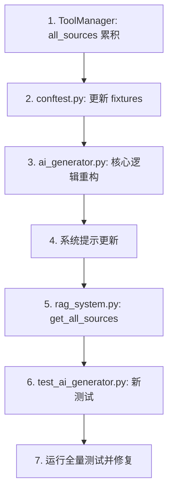

# 顺序工具调用重构 — 最终综合方案

> 综合子任务 A（架构设计）和子任务 B（测试设计）的成果

## 1. 修改文件清单

| 文件 | 修改类型 | 内容 |
|------|---------|------|
| [`backend/ai_generator.py`](../backend/ai_generator.py) | 🔴 重构 | 顺序循环、系统提示更新 |
| [`backend/search_tools.py`](../backend/search_tools.py) | 🟡 增强 | ToolManager sources 累积 |
| [`backend/rag_system.py`](../backend/rag_system.py) | 🟢 微调 | `get_last_sources()` → `get_all_sources()` |
| [`backend/tests/conftest.py`](../backend/tests/conftest.py) | 🟡 增强 | 新增 5 fixtures，修改 3 fixtures |
| [`backend/tests/test_ai_generator.py`](../backend/tests/test_ai_generator.py) | 🔴 重构 | 替换旧测试，新增 7 个测试 |

---

## 2. 核心架构：`_sequential_tool_loop()`

替换当前的 `_handle_tool_execution()` 方法。

### 2.1 `AIGenerator.__init__` 变更

```python
# 修改前
def __init__(self, api_key: str, base_url: str, model: str):

# 修改后  
def __init__(self, api_key: str, base_url: str, model: str, max_tool_rounds: int = 2):
    self.max_tool_rounds = max_tool_rounds
```

### 2.2 `generate_response()` 入口变更

两子任务一致同意的流程：

```python
def generate_response(self, query, conversation_history=None, tools=None, tool_manager=None):
    # 构建 messages (system + user) — 不变
    messages = [...]
    
    # 首次 API 调用（始终带 tools）
    api_params = {**self.base_params, "messages": messages}
    if tools:
        api_params["tools"] = tools
        api_params["tool_choice"] = "auto"
    
    response = self.client.chat.completions.create(**api_params)
    
    # 进入顺序循环
    if response.choices[0].finish_reason == "tool_calls" and tool_manager:
        return self._sequential_tool_loop(response, messages, tools, tool_manager)
    
    return response.choices[0].message.content
```

### 2.3 `_sequential_tool_loop()` 方法

```python
def _sequential_tool_loop(self, initial_response, messages, tools, tool_manager):
    current_response = initial_response
    current_messages = messages.copy()

    for round_num in range(self.max_tool_rounds):
        assistant_msg = current_response.choices[0].message

        # 终止条件 (b): Claude 不再调用工具
        if current_response.choices[0].finish_reason != "tool_calls":
            return assistant_msg.content

        # 追加 assistant message（使用 model_dump() 确保可序列化）
        current_messages.append(assistant_msg.model_dump())

        # 执行所有 tool_call
        for tool_call in assistant_msg.tool_calls:
            try:
                tool_result = tool_manager.execute_tool(
                    tool_call.function.name,
                    **json.loads(tool_call.function.arguments)
                )
            except Exception as e:
                tool_result = f"Tool execution error: {str(e)}"  # 终止条件 (c)

            current_messages.append({
                "role": "tool",
                "tool_call_id": tool_call.id,
                "content": tool_result
            })

        # 构建下一轮 API 参数
        round_params = {**self.base_params, "messages": current_messages}

        is_last_round = (round_num == self.max_tool_rounds - 1)
        if not is_last_round:
            round_params["tools"] = tools        # 非最后一轮：保留 tools
            round_params["tool_choice"] = "auto"
        # 最后一轮：不传 tools → LLM 必须直接回答

        current_response = self.client.chat.completions.create(**round_params)

    # 终止条件 (a): 达到 max_tool_rounds
    return current_response.choices[0].message.content or "I have completed my analysis."
```

### 2.4 终止条件

| 条件 | 触发方式 | 处理 |
|------|---------|------|
| (a) 达到 max_tool_rounds | `round_num == max_tool_rounds - 1` 后 | 移除 tools，强制 LLM 给出最终回答 |
| (b) 无工具调用 | `finish_reason != "tool_calls"` | 直接返回 content |
| (c) 工具执行异常 | `try/except` 捕获 | 错误信息作为 tool result 内容，让 LLM 处理 |

---

## 3. 系统提示更新

### 从 [`backend/ai_generator.py:19`](../backend/ai_generator.py:19) 移除：
```
- **One tool call per query maximum** — do not call both tools.
```

### 在 `Tool Usage Guidelines` 末尾新增：

```
- **Multi-step reasoning**: When a question requires multiple pieces of information
  (e.g., first find a course outline, then search for related content), you may
  call tools sequentially across multiple rounds. Each round builds on the 
  previous results.
- **Plan before calling**: If you need information from one tool to formulate 
  parameters for another, call them one at a time across rounds.
- **Maximum tool rounds**: You have up to 2 rounds of tool calls to gather 
  the information you need. Use them wisely.
```

---

## 4. ToolManager sources 累积

### [`backend/search_tools.py`](../backend/search_tools.py) 变更

```python
class ToolManager:
    def __init__(self):
        self.tools = {}
        self.all_sources = []  # ← 新增

    def execute_tool(self, tool_name: str, **kwargs) -> str:
        if tool_name not in self.tools:
            return f"Tool '{tool_name}' not found"
        
        result = self.tools[tool_name].execute(**kwargs)
        
        # ← 新增：自动累积 sources
        if hasattr(self.tools[tool_name], 'last_sources'):
            if self.tools[tool_name].last_sources:
                self.all_sources.extend(self.tools[tool_name].last_sources)
                self.tools[tool_name].last_sources = []
        
        return result

    def get_all_sources(self) -> list:  # ← 新增
        return self.all_sources

    def reset_sources(self):            # ← 修改
        self.all_sources = []
        for tool in self.tools.values():
            if hasattr(tool, 'last_sources'):
                tool.last_sources = []
```

### [`backend/rag_system.py`](../backend/rag_system.py) 变更

```python
# 修改前
sources = self.tool_manager.get_last_sources()

# 修改后
sources = self.tool_manager.get_all_sources()
```

---

## 5. 测试设计

### 5.1 测试类结构

```python
class TestSequentialToolLoop:
    """顺序工具调用轮次控制"""
    - test_sequential_two_rounds        # 两轮调用
    - test_early_termination_no_tool    # 提前终止
    - test_max_rounds_enforced          # 强制终止
    - test_tool_execution_error         # 工具异常

class TestSequentialAPIParams:
    """API 参数正确性"""
    - test_tools_remain_in_second_round  # 第2轮仍有tools
    - test_final_round_removes_tools     # 末轮无tools
    - test_message_context_preserved     # 消息链保留
```

### 5.2 关键测试：`test_sequential_two_rounds`

验证 LLM 连续两次返回 `tool_calls` 时，两轮工具都被正确执行。

**数据流**：`API(1) → tool_calls(outline) → API(2) → tool_calls(search) → API(3) → stop(final)`

**关键断言**：
- `execute_tool` 被调用了 2 次
- 第 1 次调用 `get_course_outline`
- 第 2 次调用 `search_course_content`
- API 总调用 3 次

### 5.3 关键测试：`test_max_rounds_enforced`

验证即使 Claude 在第 2 轮还想调工具，也被强制停止。

**关键断言**：
- 第 2 次 API 调用有 `tools`（非最后一轮）
- 第 3 次 API 调用无 `tools`（最后一轮被移除）

### 5.4 新增 Mock Fixtures

| Fixture | 用途 |
|---------|------|
| `mock_two_round_responses` | 3 个响应的列表：outline → search → final |
| `mock_openai_tool_call_response_v2` | 第二个工具调用（不同函数/参数） |
| `mock_second_round_no_tool` | Round 1 调工具，Round 2 直接 stop |
| `tool_manager_with_both_tools` | 注册了 search + outline 的 ToolManager |
| `outline_tool` | 独立的 CourseOutlineTool mock |

### 5.5 修改现有 Fixtures

所有 `mock_*_response` fixtures 添加 `model_dump()` 方法，返回纯 dict 结构。

---

## 6. 实现顺序



---

## 7. 参考文档

- 完整架构方案：[`sequential-tool-calls-design.md`](sequential-tool-calls-design.md)（子任务 A）
- 完整测试方案：[`sequential-tool-calls-test-design.md`](sequential-tool-calls-test-design.md)（子任务 B）
