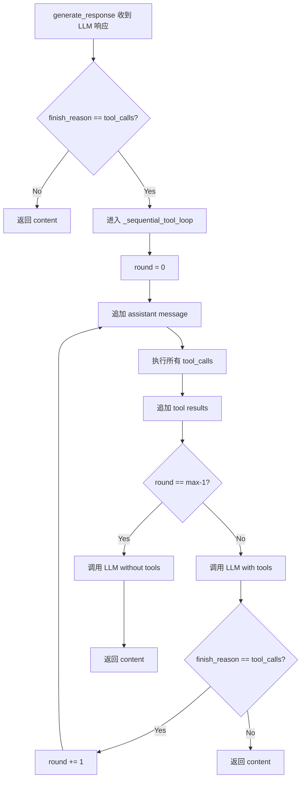

# 顺序工具调用重构设计方案

> 目标：重构 [`backend/ai_generator.py`](../backend/ai_generator.py) 以支持最多 2 轮顺序工具调用。

---

## 1. 当前流程分析

### 1.1 现有调用链

```
rag_system.query()
  └─► ai_generator.generate_response(query, tools, tool_manager)
        ├─► LLM(messages, tools)           ← 首次含 tools
        ├─► finish_reason == "tool_calls" ?
        │     └─► _handle_tool_execution()
        │           ├─► 追加 assistant message (含 tool_calls)
        │           ├─► 执行所有 tool_call → 追加 tool result
        │           └─► LLM(messages)       ← 第二次不含 tools ← 问题！
        └─► 返回最终文本
```

### 1.2 核心缺陷

[`backend/ai_generator.py:137-141`](../backend/ai_generator.py:137-141) 中，`_handle_tool_execution()` 在第二次调用 LLM 时**移除了 `tools` 参数**：

```python
# Prepare final API call without tools
final_params = {
    **self.base_params,
    "messages": messages           # ← 没有 "tools" key！
}
```

这意味着 Claude 只能做**一轮**工具调用，看到结果后如果还需要调用另一个工具，无法继续。

### 1.3 关键约束

来自 [`.roo/rules-architect/AGENTS.md`](../.roo/rules-architect/AGENTS.md):
> Tool calling is single-turn: Only one round of tool execution supported — no multi-step tool chains

同时系统提示中写死：
> `"One tool call per query maximum — do not call both tools."`

---

## 2. 目标场景示例

```
用户: "找一门讨论与课程X第4课相同主题的课程"

Round 1 → Claude 调 get_course_outline("课程X")
         → 得到第4课标题 "Prompt Compression"
         
Round 2 → Claude 调 search_course_content(query="Prompt Compression")
         → 找到其他课程也覆盖此主题
         
Final  → Claude 综合两轮结果给出完整回答
```

---

## 3. 设计方案

### 3.1 `_sequential_tool_loop()` 方法架构

#### 方法签名

```python
def _sequential_tool_loop(
    self,
    initial_response,
    messages: List[Dict[str, Any]],
    tools: Optional[List[Dict[str, Any]]],
    tool_manager,
    max_tool_rounds: int = 2
) -> str:
```

#### 参数说明

| 参数 | 类型 | 说明 |
|------|------|------|
| `initial_response` | `ChatCompletion` | 首次 LLM 调用的响应（`finish_reason == "tool_calls"`） |
| `messages` | `List[Dict]` | 当前消息列表（已有 system + user 消息） |
| `tools` | `Optional[List]` | 工具定义，每轮都传入 |
| `tool_manager` | `ToolManager` | 工具执行管理器 |
| `max_tool_rounds` | `int` | 最大工具调用轮数，默认 2 |

#### 返回值

`str` — 最终响应文本。

#### 终止条件

| 条件 | 描述 | 处理方式 |
|------|------|----------|
| (a) `round_num >= max_tool_rounds` | 达到最大轮数 | 移除 tools，调用 LLM 获取最终合成回答 |
| (b) `finish_reason != "tool_calls"` | Claude 不再调用工具 | 直接返回 `.message.content` |
| (c) 工具调用失败 | 执行时抛出异常 | 捕获异常，将错误信息作为 tool result 追加，让 LLM 处理 |

#### 伪代码

```python
def _sequential_tool_loop(self, initial_response, messages, tools, tool_manager, max_tool_rounds=2):
    current_response = initial_response
    current_messages = messages.copy()

    for round_num in range(max_tool_rounds):
        # ── 1. 取 assistant message ──
        assistant_msg = current_response.choices[0].message

        # 条件(b): Claude 没有调用工具 → 提前返回
        if current_response.choices[0].finish_reason != "tool_calls":
            return assistant_msg.content

        # ── 2. 追加 assistant message（含 tool_calls）──
        current_messages.append(assistant_msg)

        # ── 3. 执行所有 tool call ──
        for tool_call in assistant_msg.tool_calls:
            try:
                tool_result = tool_manager.execute_tool(
                    tool_call.function.name,
                    **json.loads(tool_call.function.arguments)
                )
            except Exception as e:
                tool_result = f"Tool execution error: {str(e)}"  # 条件(c)

            current_messages.append({
                "role": "tool",
                "tool_call_id": tool_call.id,
                "content": tool_result
            })

        # ── 4. 构建下一轮 API 参数 ──
        round_params = {
            **self.base_params,
            "messages": current_messages,
        }

        # 条件(a): 如果是最后一轮，移除 tools 强制 Claude 给出回答
        if round_num == max_tool_rounds - 1:
            # 最后一轮：不加 tools，Claude 必须给出最终回答
            pass  # tools 不加入 params
        else:
            # 非最后一轮：保留 tools，允许继续调用
            round_params["tools"] = tools
            round_params["tool_choice"] = "auto"

        # ── 5. 调用 LLM ──
        current_response = self.client.chat.completions.create(**round_params)

    # 条件(a) 到达：返回最后一次响应的内容
    return current_response.choices[0].message.content or "I have completed my analysis."
```

#### 关键设计决策

**为什么最后一轮移除 tools？**

如果最后一轮还保留 tools，Claude 有可能发起第 3 轮工具调用。但我们限制了最大 2 轮，所以最后一轮强制 Claude 在**没有工具可用**的情况下给出最终回答。这符合 OpenAI API 的行为：当 `tools` 不在参数中时，Claude 不会产生 `tool_calls`。

#### 状态图



---

### 3.2 `generate_response()` 适配

[`backend/ai_generator.py:50-99`](../backend/ai_generator.py:50-99) 需要修改入口逻辑：

```python
def generate_response(self, query, conversation_history=None, tools=None, tool_manager=None):
    # 构建 messages（不变）
    messages = []
    system_content = (
        f"{self.SYSTEM_PROMPT}\n\nPrevious conversation:\n{conversation_history}"
        if conversation_history
        else self.SYSTEM_PROMPT
    )
    messages.append({"role": "system", "content": system_content})
    messages.append({"role": "user", "content": query})

    # 首次 API 调用（始终带 tools）
    api_params = {
        **self.base_params,
        "messages": messages,
    }
    if tools:
        api_params["tools"] = tools
        api_params["tool_choice"] = "auto"

    response = self.client.chat.completions.create(**api_params)

    # 如果触发工具调用 → 进入循环
    if response.choices[0].finish_reason == "tool_calls" and tool_manager:
        return self._sequential_tool_loop(
            initial_response=response,
            messages=messages,
            tools=tools,           # ← 新：传入 tools
            tool_manager=tool_manager,
            max_tool_rounds=2      # ← 新：最大轮数
        )

    # 无工具调用 → 直接返回
    return response.choices[0].message.content
```

---

### 3.3 系统提示更新

#### 需要移除的内容

从 [`backend/ai_generator.py:19`](../backend/ai_generator.py:19) 移除：
> `- **One tool call per query maximum** — do not call both tools.`

#### 需要新增的内容

在 `Tool Usage Guidelines` 段落末尾添加多轮协作说明：

```
- **Multi-step reasoning**: When a question requires multiple pieces of information
  (e.g., first find a course outline, then search for related content), you may
  call tools sequentially across multiple rounds. Each round builds on the 
  previous results.
- **Plan before calling**: If you need information from one tool to formulate 
  parameters for another, call them one at a time across rounds.
- **Maximum tool rounds**: You have up to 2 rounds of tool calls to gather 
  the information you need. Use them wisely.
```

#### 完整更新后的系统提示结构

```
You are an AI assistant specialized in course materials...

Available Tools:
1. search_course_content — ...
2. get_course_outline — ...

Tool Usage Guidelines:
- For outline/syllabus/structure questions: ...
- For specific lesson content questions: ...
- Synthesize tool results into accurate, fact-based responses.
- If a tool yields no results, state this clearly without offering alternatives.
- CRITICAL: When asked about a course outline, syllabus, or lesson list...
- [NEW] Multi-step reasoning: ...
- [NEW] Plan before calling: ...
- [NEW] Maximum tool rounds: ...

Response Protocol:
- General knowledge questions: ...
- Course-specific questions: ...
- No meta-commentary: ...

All responses must be:
1. Brief, Concise and focused...
...
```

---

### 3.4 消息上下文保留策略

#### 核心原则

**所有历史消息必须保留在 `messages` 列表中**，包括：
1. System message（不变）
2. User query（不变）
3. Assistant message（含 `tool_calls`，每轮追加一次）
4. Tool result message（`role: "tool"`，每轮追加一次）

#### 消息序列示例（2轮场景）

```
messages = [
    {"role": "system",      "content": "..."},                    # 初始
    {"role": "user",        "content": "找与课程X第4课相同主题的课程"},  # 初始
    # ── Round 1 ──
    {"role": "assistant",   "content": None,                      # 第1轮追加
                           "tool_calls": [{
                               "id": "call_1",
                               "function": {"name": "get_course_outline", 
                                           "arguments": '{"course_title": "课程X"}'}
                           }]},
    {"role": "tool",        "tool_call_id": "call_1",             # 第1轮追加
                           "content": "Lesson 4: Prompt Compression"},
    # ── Round 2 ──
    {"role": "assistant",   "content": None,                      # 第2轮追加
                           "tool_calls": [{
                               "id": "call_2",
                               "function": {"name": "search_course_content",
                                           "arguments": '{"query": "Prompt Compression"}'}
                           }]},
    {"role": "tool",        "tool_call_id": "call_2",             # 第2轮追加
                           "content": "Course Y also covers prompt compression..."},
    # ── Final ──
    {"role": "assistant",   "content": "以下是找到的结果..."},      # 最终回复
]
```

#### 代码中的实现要点

- 使用 `messages.copy()` 在每次迭代开始时创建独立副本，避免意外修改
- `current_messages` 在循环外声明，在循环内逐步追加
- 每个 `append()` 操作都是不可变的（直接追加新 dict，不修改已有元素）

#### 注意事项

`OpenAI` SDK 的 `ChatCompletionMessage` 对象不能直接用 `dict()` 序列化。当前代码使用 `.model_dump()`（或直接在消息列表中添加原始 `assistant_message`）需要确认正确性。

检查当前 [line 120](../backend/ai_generator.py:120)：
```python
messages.append(assistant_message)
```

这里直接 append 了 SDK 返回的对象。在顺序循环中，第二次调用 LLM 时，消息列表包含 SDK 对象而非原始 dict，可能会导致序列化问题。

**建议**：使用 `assistant_message.model_dump()` 确保消息可序列化。

```python
# 替换 line 120
messages.append(assistant_message.model_dump())  # 确保纯 dict 结构
```

---

### 3.5 `max_tool_rounds` 配置

#### 设计原则

当前硬编码为 2，但设计上支持未来可配置。

#### 方案 A（推荐）：`AIGenerator.__init__` 参数

```python
class AIGenerator:
    def __init__(self, api_key: str, base_url: str, model: str, max_tool_rounds: int = 2):
        self.client = OpenAI(api_key=api_key, base_url=base_url)
        self.model = model
        self.max_tool_rounds = max_tool_rounds
        # ... 其余不变
```

然后在 `_sequential_tool_loop()` 中使用 `self.max_tool_rounds` 而非参数。

#### 方案 B（未来扩展）：`Config` 类

[`backend/config.py:28`](../backend/config.py:28) 中 `Config` 类可新增字段：

```python
@dataclass
class Config:
    # ... 现有字段
    MAX_TOOL_ROUNDS: int = 2  # 新增
```

但考虑到当前仅有 AIGenerator 使用此值，且 AIGenerator 的构造参数已经接受独立的 API key/base_url/model，保持 `max_tool_rounds` 作为 AIGenerator 的构造参数更一致。

#### 推荐

**本次实现**：AIGenerator 构造参数，默认 2。

```python
def __init__(self, api_key: str, base_url: str, model: str, max_tool_rounds: int = 2):
    ...
    self.max_tool_rounds = max_tool_rounds
```

**未来**：如果需要在不同场景使用不同轮数，可从 Config 传入。

---

### 3.6 `rag_system.query()` sources 收集适配

#### 当前问题

[`backend/rag_system.py:208-212`](../backend/rag_system.py:208-212)：

```python
# Get sources from the search tool
sources = self.tool_manager.get_last_sources()
self.tool_manager.reset_sources()
```

`ToolManager.get_last_sources()` 只返回**最近一次** `CourseSearchTool` 的 `last_sources`。在顺序调用场景中：
- Round 1 调用 `get_course_outline` → 不产生 sources（`CourseOutlineTool` 没有 `last_sources`）
- Round 2 调用 `search_course_content` → 产生 sources，覆盖了第 1 轮

如果第 1 轮也产生了搜索 sources，它们会被第 2 轮覆盖。

#### 解决方案

**方案 A（推荐）：`ToolManager` 增加累积 sources**

```python
class ToolManager:
    def __init__(self):
        self.tools = {}
        self.all_sources = []  # ← 新增：累积所有轮次的 sources
    
    def execute_tool(self, tool_name: str, **kwargs) -> str:
        if tool_name not in self.tools:
            return f"Tool '{tool_name}' not found"
        
        result = self.tools[tool_name].execute(**kwargs)
        
        # ← 新增：执行后自动收集 sources
        if hasattr(self.tools[tool_name], 'last_sources'):
            self.all_sources.extend(self.tools[tool_name].last_sources)
            self.tools[tool_name].last_sources = []  # 清空以免重复
        
        return result
    
    def get_all_sources(self) -> list:   # ← 新增
        """获取所有轮次累积的 sources"""
        return self.all_sources
    
    def reset_sources(self):             # ← 修改
        """重置所有 sources"""
        self.all_sources = []
        for tool in self.tools.values():
            if hasattr(tool, 'last_sources'):
                tool.last_sources = []
```

**方案 B（轻量）：`rag_system.query()` 手动累积**

```python
def query(self, query, session_id=None):
    ...
    all_sources = []
    
    # 通过一个 wrapper 注入到 ai_generator
    ...
```

方案 A 更干净，因为封装了 sources 管理逻辑。

#### `rag_system.query()` 适配后代码

```python
def query(self, query, session_id=None):
    # ... 现有 outline_context 检测逻辑不变 ...
    
    response = self.ai_generator.generate_response(
        query=prompt,
        conversation_history=history,
        tools=self.tool_manager.get_tool_definitions(),
        tool_manager=self.tool_manager
    )
    
    # 获取所有轮次的累积 sources（新方法）
    sources = self.tool_manager.get_all_sources()
    self.tool_manager.reset_sources()
    
    # ... 更新 conversation history 逻辑不变 ...
    
    return response, sources
```

---

## 4. 修改文件清单

| 文件 | 修改内容 |
|------|----------|
| [`backend/ai_generator.py`](../backend/ai_generator.py) | 1. `__init__` 增加 `max_tool_rounds` 参数<br>2. 更新 `SYSTEM_PROMPT` 移除 "one tool call" 限制，添加多轮说明<br>3. `generate_response()` 改为进入 `_sequential_tool_loop`<br>4. 新增 `_sequential_tool_loop()` 方法<br>5. 删除 `_handle_tool_execution()` 方法（被替换）<br>6. 使用 `model_dump()` 确保消息可序列化 |
| [`backend/search_tools.py`](../backend/search_tools.py) | 1. `ToolManager.__init__` 增加 `all_sources = []`<br>2. 新增 `get_all_sources()` 方法<br>3. 修改 `execute_tool()` 自动累积 sources<br>4. 修改 `reset_sources()` 清空 `all_sources` |
| [`backend/rag_system.py`](../backend/rag_system.py) | 1. `query()` 中 `get_last_sources()` → `get_all_sources()` |

---

## 5. 与现有测试的兼容性

### 需要更新的测试

| 测试文件 | 测试 | 影响 |
|----------|------|------|
| [`backend/tests/test_ai_generator.py:79-110`](../backend/tests/test_ai_generator.py:79-110) | `test_handle_tool_execution_calls_tool_manager` | 方法名变更，需改为 `_sequential_tool_loop` |
| [`backend/tests/test_ai_generator.py:111-137`](../backend/tests/test_ai_generator.py:111-137) | `test_handle_tool_execution_final_response` | 同上 |
| [`backend/tests/test_ai_generator.py:139-175`](../backend/tests/test_ai_generator.py:139-175) | `test_tool_execution_appends_tool_result_to_messages` | 需验证 tools 仍在参数中（非最后一轮时） |
| [`backend/tests/test_ai_generator.py:14-22`](../backend/tests/test_ai_generator.py:14-22) | `test_system_prompt_mentions_*` | 需要更新断言检测新提示内容 |
| [`backend/tests/conftest.py:158-177`](../backend/tests/conftest.py:158-177) | `mock_openai_tool_call_response` | 可能需要新增 `model_dump()` mock |

### 需要新增的测试

1. **两轮顺序调用测试**：mock 第一次返回 `get_course_outline` 的 tool_call，第二次返回 `search_course_content` 的 tool_call
2. **提前终止测试**：Round 1 后 Claude 返回 `stop`，验证不进入 Round 2
3. **达到 max rounds 测试**：验证 2 轮后强制返回
4. **sources 累积测试**：多轮搜索后验证 `get_all_sources()` 包含所有 sources

---

## 6. 风险与注意事项

1. **Token 消耗增加**：多轮调用 + 完整消息历史 → 每轮 API 调用会消耗更多 tokens。`max_tool_rounds=2` 时，最大消息体约为单轮的 2-3 倍。`max_tokens=800` 可能需要调整为更大的值（如 1024）以容纳更长的最终回答。
2. **Assistant 消息序列化**：直接 append SDK 返回的 `ChatCompletionMessage` 对象可能在某些 API 实现中不可用。使用 `model_dump()` 转为纯 dict 更安全。
3. **工具执行失败处理**：条件 (c) 下，异常应作为 tool result 内容返回（而非抛出），让 LLM 决定如何向用户说明。
4. **Claude "tool_choice" 行为**：OpenAI 兼容 API 中，`tool_choice: "auto"` 时 Claude 可能第一轮不调工具直接回答，也可能一轮调多个工具。循环逻辑需要处理 `len(tool_calls) > 1` 的情况（当前代码已支持批量执行）。
5. **最后轮次的内容为 None**：如果 max rounds 到达时 Claude 仍返回 `tool_calls`，`message.content` 为 `None`。需要提供 fallback 消息。
