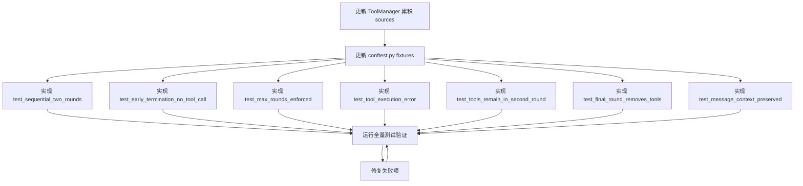

# 顺序工具调用 — 测试与错误处理设计方案

> 子任务 B：专注 API 流程细节、错误处理和测试设计
> 基于 [`plans/sequential-tool-calls-design.md`](sequential-tool-calls-design.md) 中的重构方案

---

## 目录

1. [测试用例设计（外部行为验证）](#1-测试用例设计外部行为验证)
2. [Mock 数据结构设计](#2-mock-数据结构设计)
3. [OpenAI API 兼容性分析](#3-openai-api-兼容性分析)
4. [ToolManager sources 累积方案](#4-toolmanager-sources-累积方案)
5. [conftest.py 更新方案](#5-conftestpy-更新方案)

---

## 1. 测试用例设计（外部行为验证）

所有测试遵循 **外部行为验证** 原则：不关心内部实现细节（如具体哪个私有方法被调用），只验证公开方法的输入/输出行为和可观察的副作用。

### 测试类结构

```python
class TestSequentialToolLoop:
    """Suite: _sequential_tool_loop 的轮次控制和终止条件"""
    # test_sequential_two_rounds
    # test_early_termination_no_tool_call
    # test_max_rounds_enforced
    # test_tool_execution_error

class TestSequentialAPIParams:
    """Suite: API 参数在不同轮次的正確性"""
    # test_tools_remain_in_second_round
    # test_final_round_removes_tools
    # test_message_context_preserved
```

---

### 1.1 `test_sequential_two_rounds` — 两轮顺序调用

**目标**：验证当 LLM 连续两次返回 `tool_calls` 时，两轮工具都被正确执行。

**场景**：用户问 "找一门讨论与课程X第4课相同主题的课程"
- Round 1: Claude 调 `get_course_outline("Course X")`
- Round 2: Claude 调 `search_course_content(query="Prompt Compression")`

**测试数据流**：
```
API Call 1 → mock_response_round1 (finish_reason="tool_calls", get_course_outline)
API Call 2 → mock_response_round2 (finish_reason="tool_calls", search_course_content)
API Call 3 → mock_final_response (finish_reason="stop", final answer)
```

**伪代码**：
```python
def test_sequential_two_rounds(
    mock_two_round_responses,  # 3 个响应的 side_effect
    tool_manager_with_both_tools,
):
    from ai_generator import AIGenerator

    generator = AIGenerator(api_key="test-key", base_url="https://test.com", model="test-model")

    mock_create = MagicMock()
    mock_create.side_effect = mock_two_round_responses  # [round1, round2, final]

    with patch.object(generator.client.chat.completions, "create", mock_create):
        with patch.object(tool_manager_with_both_tools, "execute_tool",
                          wraps=tool_manager_with_both_tools.execute_tool) as spy:
            response = generator.generate_response(
                query="Find a course covering the same topic as Course X Lesson 4",
                tools=tool_manager_with_both_tools.get_tool_definitions(),
                tool_manager=tool_manager_with_both_tools,
            )

            # 验证 execute_tool 被调用了 2 次
            assert spy.call_count == 2

            # 第 1 次调用：get_course_outline
            call_1_name, call_1_kwargs = spy.call_args_list[0]
            assert call_1_name[0] == "get_course_outline"
            assert "course_title" in call_1_kwargs

            # 第 2 次调用：search_course_content
            call_2_name, call_2_kwargs = spy.call_args_list[1]
            assert call_2_name[0] == "search_course_content"
            assert "query" in call_2_kwargs

            # 验证最终响应
            assert response is not None
            assert isinstance(response, str)

    # 验证 API 被调用了 3 次（2 轮工具 + 1 次最终回答）
    assert mock_create.call_count == 3
```

**关键验证点**：
| 验证项 | 断言方式 |
|--------|---------|
| `execute_tool` 调用次数 | `spy.call_count == 2` |
| 第 1 次调用的工具名 | `call_args_list[0].args[0] == "get_course_outline"` |
| 第 2 次调用的工具名 | `call_args_list[1].args[0] == "search_course_content"` |
| API 总调用次数 | `mock_create.call_count == 3` |
| 最终响应存在 | `isinstance(response, str)` |

---

### 1.2 `test_early_termination_no_tool_call` — 提前终止

**目标**：Round 1 后 Claude 返回 `finish_reason="stop"`，验证不进入 Round 2。

**场景**：Claude 在第一轮就选择直接回答问题，不需要调用工具。

**测试数据流**：
```
API Call 1 → mock_response_no_tool (finish_reason="stop", content="直接回答")
```

**伪代码**：
```python
def test_early_termination_no_tool_call(mock_openai_chat_completion):
    from ai_generator import AIGenerator

    generator = AIGenerator(api_key="test-key", base_url="https://test.com", model="test-model")

    with patch.object(generator.client.chat.completions, "create",
                      return_value=mock_openai_chat_completion) as mock_create:
        response = generator.generate_response(
            query="What is the capital of France?",
            tools=tool_definitions,  # 即使提供了 tools
            tool_manager=None,       # tool_manager=None 确保不进入工具循环
        )

        # 直接返回 LLM 回答
        assert "computer use" in response.lower()

        # 只调用了 1 次 API
        mock_create.assert_called_once()

        # 验证 tools 参数存在（首次调用始终带 tools）
        assert "tools" in mock_create.call_args[1]
```

**关键验证点**：
| 验证项 | 断言方式 |
|--------|---------|
| API 调用次数 | `mock_create.assert_called_once()` |
| 返回内容 | 直接返回 LLM 的 content |
| `execute_tool` 未调用 | `tool_manager.execute_tool` 未被调用（不需要 mock） |

---

### 1.3 `test_max_rounds_enforced` — 最大轮数强制执行

**目标**：即使 Claude 在第 2 轮还想调工具，也被强制返回最终回答。

**场景**：Claude 在第 2 轮仍然返回 `finish_reason="tool_calls"`，但系统强制停止并移除 tools，让 Claude 给出最终回答。

**测试数据流**：
```
API Call 1 → mock_response_round1 (finish_reason="tool_calls", some_tool)
API Call 2 → mock_response_round2 (finish_reason="tool_calls", another_tool) ← 第 2 轮仍想调工具
API Call 3 → mock_final_response (finish_reason="stop", final answer)  ← 无 tools 强制回答
```

**此测试的特殊挑战**：需要验证第 2 次 API 调用（即进入 `_sequential_tool_loop` 后的第 1 次迭代）**没有 `tools` 参数**。

**伪代码**：
```python
def test_max_rounds_enforced(
    mock_openai_tool_call_response,     # Round 1: tool_calls
    mock_openai_tool_call_response_v2,  # Round 2: tool_calls (第二次仍想调工具)
    mock_openai_final_response,         # Final: stop
    tool_manager,
):
    from ai_generator import AIGenerator

    generator = AIGenerator(api_key="test-key", base_url="https://test.com",
                            model="test-model", max_tool_rounds=2)

    mock_create = MagicMock()
    mock_create.side_effect = [
        mock_openai_tool_call_response,      # API Call 1 (generate_response)
        mock_openai_tool_call_response_v2,   # API Call 2 (loop round 1 → still wants tools)
        mock_openai_final_response,          # API Call 3 (final, no tools)
    ]

    with patch.object(generator.client.chat.completions, "create", mock_create):
        response = generator.generate_response(
            query="Complex query needing many tools",
            tools=tool_manager.get_tool_definitions(),
            tool_manager=tool_manager,
        )

        assert response is not None
        assert mock_create.call_count == 3

        # 关键断言：第 2 次 API 调用（loop round 1）仍有 tools
        call_2_kwargs = mock_create.call_args_list[1][1]
        assert "tools" in call_2_kwargs  # 非最后一轮保留 tools

        # 关键断言：第 3 次 API 调用（loop round 2 = 最后一轮）没有 tools
        call_3_kwargs = mock_create.call_args_list[2][1]
        assert "tools" not in call_3_kwargs  # 最后一轮移除 tools
```

**关键验证点**：
| 验证项 | 断言方式 |
|--------|---------|
| API 调用 3 次 | `mock_create.call_count == 3` |
| 第 2 次 API 有 tools | `"tools" in call_args_list[1][1]` |
| 第 3 次 API 无 tools | `"tools" not in call_args_list[2][1]` |
| `execute_tool` 调用 2 次 | `spy.call_count == 2` |

---

### 1.4 `test_tool_execution_error` — 工具执行异常

**目标**：工具执行抛出异常时，优雅处理并将错误信息作为 tool result 追加。

**场景**：`CourseSearchTool.execute()` 内部抛出异常（如 ChromaDB 连接失败）。

**伪代码**：
```python
def test_tool_execution_error(
    mock_openai_tool_call_response,
    mock_openai_final_response,
    tool_manager,
):
    from ai_generator import AIGenerator

    generator = AIGenerator(api_key="test-key", base_url="https://test.com",
                            model="test-model")

    mock_create = MagicMock()
    mock_create.side_effect = [
        mock_openai_tool_call_response,   # tool_calls
        mock_openai_final_response,       # final response
    ]

    with patch.object(generator.client.chat.completions, "create", mock_create):
        # 让 execute_tool 抛出异常
        with patch.object(tool_manager, "execute_tool",
                          side_effect=ValueError("ChromaDB connection failed")):
            # 不应该抛异常到外部
            response = generator.generate_response(
                query="What is computer use?",
                tools=tool_manager.get_tool_definitions(),
                tool_manager=tool_manager,
            )

            # 验证异常被捕获并返回了 fallback 响应
            assert response is not None
            assert isinstance(response, str)

    # 验证 execute_tool 确实被调用了
    # 验证异常后系统仍能返回结果（不崩溃）
    assert mock_create.call_count == 2
```

**关键验证点**：
| 验证项 | 断言方式 |
|--------|---------|
| 不抛出异常到外部 | 测试正常执行完毕 |
| 最终响应非空 | `response is not None` |
| API 仍被调用 2 次 | `mock_create.call_count == 2` |
| 错误信息注入到消息中 | 间接验证：LLM 收到了 tool result |

**注意**：此测试可加一个更精确的版本，验证追加的 tool message 中包含 `"ChromaDB connection failed"` 字样。

---

### 1.5 `test_tools_remain_in_second_round` — 第 2 轮保留 tools

**目标**：第 2 轮 API 调用（`max_tool_rounds=2` 时的第一轮循环迭代）仍然包含 `tools` 参数。

**伪代码**：
```python
def test_tools_remain_in_second_round(
    mock_openai_tool_call_response,
    mock_openai_tool_call_response_v2,
    tool_manager,
):
    from ai_generator import AIGenerator

    generator = AIGenerator(api_key="test-key", base_url="https://test.com",
                            model="test-model", max_tool_rounds=3)  # 3 轮以测试 "第 2 轮"

    # 需要 mock 一个会在第 2 轮继续调工具的响应
    mock_final = MagicMock()
    mock_final.choices[0].message.content = "Final answer"
    mock_final.choices[0].finish_reason = "stop"

    mock_create = MagicMock()
    mock_create.side_effect = [
        mock_openai_tool_call_response,      # Round 1
        mock_openai_tool_call_response_v2,   # Round 2 (仍调工具)
        mock_final,                          # Round 3 (final)
    ]

    with patch.object(generator.client.chat.completions, "create", mock_create):
        generator.generate_response(
            query="test",
            tools=tool_manager.get_tool_definitions(),
            tool_manager=tool_manager,
        )

        # 第 2 次 API 调用（Round 2）仍然有 tools
        call_2 = mock_create.call_args_list[1][1]
        assert "tools" in call_2
        assert call_2["tool_choice"] == "auto"
```

---

### 1.6 `test_final_round_removes_tools` — 最后一轮移除 tools

**目标**：当 `max_tool_rounds` 到达时，最后一次 API 调用没有 `tools` 参数。

覆盖 `sequential-tool-calls-design.md` 第 3.5 节中提到的边界情况：即使 Claude 在最后一轮仍返回 `finish_reason="tool_calls"`，`message.content` 为 `None`，也需要提供 fallback 消息。

**伪代码**：
```python
def test_final_round_removes_tools_and_handles_none_content(
    mock_openai_tool_call_response,
    mock_openai_tool_call_response_v2,  # finish_reason="tool_calls", content=None
    tool_manager,
):
    from ai_generator import AIGenerator

    generator = AIGenerator(api_key="test-key", base_url="https://test.com",
                            model="test-model", max_tool_rounds=2)

    # 最后一轮的响应：即使 Claude 还想调工具，我们强制移除 tools
    # LLM 收到没有 tools 的请求后会返回正常回答
    mock_final = MagicMock()
    mock_final.choices[0].message.content = "Here is my final answer."
    mock_final.choices[0].finish_reason = "stop"

    mock_create = MagicMock()
    mock_create.side_effect = [
        mock_openai_tool_call_response,      # Round 1
        mock_openai_tool_call_response_v2,   # Round 2 (tools removed by code)
        mock_final,                          # Final (no tools)
    ]

    with patch.object(generator.client.chat.completions, "create", mock_create):
        response = generator.generate_response(
            query="test",
            tools=tool_manager.get_tool_definitions(),
            tool_manager=tool_manager,
        )

        # Round 2 的 API 调用没有 tools
        call_2 = mock_create.call_args_list[1][1]
        assert "tools" not in call_2

        # Final 的 API 调用也没有 tools
        call_3 = mock_create.call_args_list[2][1]
        assert "tools" not in call_3

        assert response == "Here is my final answer."
```

---

### 1.7 `test_message_context_preserved` — 消息上下文保留

**目标**：完整的 assistant + tool 消息链在轮次间保留，并且最终 API 调用包含所有历史消息。

**伪代码**：
```python
def test_message_context_preserved(
    mock_openai_tool_call_response,
    mock_openai_tool_call_response_v2,
    mock_openai_final_response,
    tool_manager,
):
    from ai_generator import AIGenerator

    generator = AIGenerator(api_key="test-key", base_url="https://test.com",
                            model="test-model")

    mock_create = MagicMock()
    mock_create.side_effect = [
        mock_openai_tool_call_response,     # Round 1
        mock_openai_tool_call_response_v2,  # Round 2
        mock_openai_final_response,         # Final
    ]

    with patch.object(generator.client.chat.completions, "create", mock_create):
        generator.generate_response(
            query="test query",
            tools=tool_manager.get_tool_definitions(),
            tool_manager=tool_manager,
        )

        # 获取每次 API 调用的 messages 参数
        call_1_messages = mock_create.call_args_list[0][1]["messages"]
        call_2_messages = mock_create.call_args_list[1][1]["messages"]
        call_3_messages = mock_create.call_args_list[2][1]["messages"]

        # ── 验证消息链增长 ──
        # 第 1 次: [system, user]
        assert len(call_1_messages) == 2

        # 第 2 次: [system, user, assistant(tool_calls), tool]
        assert len(call_2_messages) == 4
        assert call_2_messages[2]["role"] == "assistant"  # Round 1 assistant
        assert call_2_messages[3]["role"] == "tool"       # Round 1 tool result

        # 第 3 次: [system, user, assistant, tool, assistant, tool]
        assert len(call_3_messages) == 6
        assert call_3_messages[4]["role"] == "assistant"  # Round 2 assistant
        assert call_3_messages[5]["role"] == "tool"       # Round 2 tool result

        # ── 验证 system + user 消息未被修改 ──
        assert call_3_messages[0]["role"] == "system"
        assert call_3_messages[1]["role"] == "user"
        assert call_3_messages[1]["content"] == "test query"

        # ── 验证 tool_call_id 对应关系 ──
        # Round 1 tool 消息的 tool_call_id = Round 1 assistant 的 tool_call.id
        round1_tool_call_id = call_2_messages[2]["tool_calls"][0].id  # 注意：SDK 对象
        assert call_3_messages[3]["tool_call_id"] == "call_12345"

        # ── 验证 tool 消息有内容 ──
        assert len(call_3_messages[3]["content"]) > 0
        assert len(call_3_messages[5]["content"]) > 0
```

**注意**：此处 `call_2_messages[2]` 是 SDK 的 `ChatCompletionMessage` 对象（用 `model_dump()` 转换前），直接访问 `.tool_calls` 需要 mock 支持。详见第 2 节。

---

## 2. Mock 数据结构设计

### 2.1 `finish_reason` 的 Mock 方式

当前 [`conftest.py:149-155`](conftest.py:149-155) 中通过 `PropertyMock` 风格设置：

```python
mock_choice = MagicMock()
mock_choice.finish_reason = "tool_calls"  # 或 "stop"
```

**原理**：`MagicMock` 的属性赋值会覆盖默认的 `PropertyMock` 返回值。这种方式在 Python 中等效于：

```python
type(mock_choice).finish_reason = PropertyMock(return_value="tool_calls")
```

**不需要修改**，因为 `unittest.mock.MagicMock` 的属性赋值就是动态的。

### 2.2 两次不同 tool_calls 的 Mock 设计

当前 [`conftest.py:161-165`](conftest.py:161-165) 只有一个 tool_call。需要新增支持两种不同工具调用的 fixture。

#### 新 Fixture: `mock_two_round_responses`

```python
@pytest.fixture
def mock_two_round_responses():
    """
    创建 3 个响应的列表，模拟两轮工具调用 + 最终回答。
    
    返回: [round1_response, round2_response, final_response]
    
    Round 1: get_course_outline(course_title="Course X")
    Round 2: search_course_content(query="Prompt Compression")
    Final:   stop, 综合回答
    """
    # ── Round 1 Tool Call ──
    tool_call_1 = MagicMock()
    tool_call_1.id = "call_outline_001"
    tool_call_1.function.name = "get_course_outline"
    tool_call_1.function.arguments = '{"course_title": "Course X"}'

    msg_1 = MagicMock()
    msg_1.content = None
    msg_1.tool_calls = [tool_call_1]

    choice_1 = MagicMock()
    choice_1.message = msg_1
    choice_1.finish_reason = "tool_calls"

    response_1 = MagicMock()
    response_1.choices = [choice_1]

    # ── Round 2 Tool Call ──
    tool_call_2 = MagicMock()
    tool_call_2.id = "call_search_002"
    tool_call_2.function.name = "search_course_content"
    tool_call_2.function.arguments = '{"query": "Prompt Compression"}'

    msg_2 = MagicMock()
    msg_2.content = None
    msg_2.tool_calls = [tool_call_2]

    choice_2 = MagicMock()
    choice_2.message = msg_2
    choice_2.finish_reason = "tool_calls"

    response_2 = MagicMock()
    response_2.choices = [choice_2]

    # ── Final Response ──
    msg_final = MagicMock()
    msg_final.content = "以下是综合两轮工具结果后的回答..."
    msg_final.tool_calls = None

    choice_final = MagicMock()
    choice_final.message = msg_final
    choice_final.finish_reason = "stop"

    response_final = MagicMock()
    response_final.choices = [choice_final]

    return [response_1, response_2, response_final]
```

#### 新 Fixture: `mock_openai_tool_call_response_v2`

用于 `test_tools_remain_in_second_round` 等测试，创建一个与 `mock_openai_tool_call_response` 不同的工具调用。

```python
@pytest.fixture
def mock_openai_tool_call_response_v2():
    """
    第二个 tool_calls 响应（函数名、参数与第一个不同）。
    用于模拟 Round 2 中 Claude 继续调用另一个工具。
    """
    mock_tool_call = MagicMock()
    mock_tool_call.id = "call_67890"
    mock_tool_call.function.name = "search_course_content"
    mock_tool_call.function.arguments = '{"query": "Prompt Compression", "course_name": "Course Y"}'

    mock_message = MagicMock()
    mock_message.content = None
    mock_message.tool_calls = [mock_tool_call]

    mock_choice = MagicMock()
    mock_choice.message = mock_message
    mock_choice.finish_reason = "tool_calls"

    mock_response = MagicMock()
    mock_response.choices = [mock_choice]
    return mock_response
```

### 2.3 `model_dump()` 行为 Mock

**核心问题**：当前 [`ai_generator.py:120`](ai_generator.py:120) 直接 append 了 `assistant_message`（SDK 对象）。在 `_sequential_tool_loop` 中，如果代码改为 `assistant_message.model_dump()`（如设计文档建议），但 mock 对象的 `model_dump()` 返回 `MagicMock` 而非 dict，会导致下游代码读不到 `role`, `content`, `tool_calls` 等字段。

**解决方案**：在 `mock_openai_tool_call_response` 中显式设置 `model_dump()` 返回值。

#### 修改现有 Fixture

```python
@pytest.fixture
def mock_openai_tool_call_response():
    """Create a mock OpenAI response with a tool call request, with model_dump support"""
    mock_tool_call = MagicMock()
    mock_tool_call.id = "call_12345"
    mock_tool_call.function.name = "search_course_content"
    mock_tool_call.function.arguments = '{"query": "computer use", "course_name": "Building Towards Computer Use"}'

    mock_message = MagicMock()
    mock_message.content = None
    mock_message.tool_calls = [mock_tool_call]

    # +++++ 新增：model_dump() 返回可用的 dict +++++
    def model_dump_side_effect():
        return {
            "role": "assistant",
            "content": None,
            "tool_calls": [
                {
                    "id": "call_12345",
                    "function": {
                        "name": "search_course_content",
                        "arguments": '{"query": "computer use", "course_name": "Building Towards Computer Use"}'
                    }
                }
            ]
        }
    mock_message.model_dump = model_dump_side_effect

    mock_choice = MagicMock()
    mock_choice.message = mock_message
    mock_choice.finish_reason = "tool_calls"

    mock_response = MagicMock()
    mock_response.choices = [mock_choice]
    return mock_response
```

**同样需要更新**：`mock_openai_tool_call_response_v2` 和 `mock_openai_final_response` 也要加 `model_dump()`。

#### `tool_calls` 内部元素的 `model_dump()`

`ChatCompletionMessage.tool_calls` 列表中每个元素也是 SDK 对象。如果代码做 `tool_call.model_dump()`，mock 的 `tool_calls[0]` 需要支持：

```python
# 在代码中可能出现的调用
for tool_call in assistant_msg["tool_calls"]:
    tool_call["function"]["name"]  # dict 方式
```

如果使用 `model_dump()` 返回 dict，则 `tool_calls` 也是 dict 列表，不需要再 `model_dump()` 内部元素。

#### 不依赖 `model_dump()` 的备选方案

如果代码直接 append 原始 assistant_message（不调 `model_dump()`），则 mock 不需要修改。这是**当前代码的做法**。

设计文档建议使用 `model_dump()` 以确保兼容性。如果实现采用该建议，则所有 mock 必须提供 `model_dump()`。

**建议**：采用 `model_dump()` 方案，因为：
1. 纯 dict 消息在所有 OpenAI 兼容 API 上都可靠
2. 避免 SDK 版本兼容问题
3. 可调试性更好（print 能看到内容）

---

## 3. OpenAI API 兼容性分析

### 3.1 `ChatCompletionMessage` 序列化问题

| 方案 | 消息格式 | 兼容性 | 风险 |
|------|---------|--------|------|
| 直接 append SDK 对象 | `messages` 包含 `MagicMock` 或 SDK 对象 | OpenAI Python SDK v1.x 支持 | 非 OpenAI 兼容 API 可能拒绝 |
| `model_dump()` 转 dict | `messages` 全是 Python dict | 所有 OpenAI 兼容 API | 需要确保 `model_dump()` 返回正确结构 |
| 手动构造 dict | 同上，但手动写 | 最可靠 | 需要维护两套结构 |

**推荐方案**：使用 `model_dump()`（方案 2），因为：
- 当前代码 [`ai_generator.py:120`](ai_generator.py:120) 直接 `messages.append(assistant_message)` 能工作是因为 OpenAI Python SDK 在序列化时内部处理了 `ChatCompletionMessage` 对象
- 但 DeepSeek 等兼容 API 的 Python SDK 实现可能不同
- `model_dump()` 在 Pydantic v2 的 `BaseModel` 上是原生方法，`ChatCompletionMessage` 继承自 Pydantic

### 3.2 `content` 为 `None` 的 Fallback

**场景**：当 `max_tool_rounds` 到达且 `finish_reason == "tool_calls"` 时，`message.content` 为 `None`。

**当前设计文档的伪代码**（[`sequential-tool-calls-design.md:155`](sequential-tool-calls-design.md:155)）：
```python
return current_response.choices[0].message.content or "I have completed my analysis."
```

**问题**：这个 fallback 是英文硬编码。建议改为：
```python
final_content = current_response.choices[0].message.content
if final_content is None:
    # 当 max_tool_rounds 到达但 LLM 仍返回 tool_calls 时的 fallback
    # 这种情况理论上不应发生（因为最后一轮没 tools），但作为防御性编程
    final_content = self._synthesize_final_response(current_messages)
return final_content
```

或者更简单的方案——直接让最后一轮（无 tools）的 LLM 调用保证有 `content`：
- 没有 `tools` 时，LLM 不会产生 `tool_calls`
- 所以 `finish_reason` 一定是 `"stop"`
- 此时 `message.content` 一定非空

**结论**：如果代码正确实现了"最后一轮移除 tools"，则 `content=None` 几乎不会发生。fallback 仅作为防御性编程存在。

### 3.3 `tool_choice` 在不同轮次的行为

| 轮次 | `tool_choice` 设置 | 预期行为 |
|------|-------------------|---------|
| 首次调用（`generate_response`） | `"auto"` | LLM 自由决定是否调工具 |
| Round N（非最后一轮） | `"auto"` | LLM 可继续调工具 |
| 最后一轮 | 不设置（无 tools） | LLM 必须直接回答 |

**兼容性问题**：
- OpenAI API：`tool_choice: "auto"` 是默认行为，LLM 可能一轮调 0 到多个工具
- 某些兼容 API（如 Ollama）可能不支持 `tool_choice` 参数，需要异常处理
- DeepSeek API：支持 `tool_choice: "auto"`，行为与 OpenAI 一致

**建议**：在 `_sequential_tool_loop` 中添加 `tool_choice` 的设置仅在非最后一轮进行：

```python
if round_num < max_tool_rounds - 1:
    round_params["tools"] = tools
    round_params["tool_choice"] = "auto"  # 仅在非最后一轮设置
```

---

## 4. ToolManager sources 累积方案

### 4.1 当前问题

[`search_tools.py:222-228`](search_tools.py:222-228) 中 `ToolManager.get_last_sources()` 只返回**最近一次**拥有 `last_sources` 的工具的 sources。

在顺序调用场景中：
| Round | 调用的工具 | 是否产生 sources |
|-------|-----------|----------------|
| 1 | `get_course_outline` | ❌（`CourseOutlineTool` 没有 `last_sources`） |
| 2 | `search_course_content` | ✅（`CourseSearchTool.last_sources` 被设置） |

如果 Round 1 也调用了 `search_course_content`，其 sources 会被 Round 2 覆盖。

### 4.2 设计方案

**推荐方案**：在 `ToolManager.execute_tool()` 中自动累积 sources。

```python
class ToolManager:
    def __init__(self):
        self.tools = {}
        self.all_sources = []  # 新增：累积所有轮次的 sources

    def execute_tool(self, tool_name: str, **kwargs) -> str:
        """Execute a tool by name and auto-collect sources"""
        if tool_name not in self.tools:
            return f"Tool '{tool_name}' not found"

        result = self.tools[tool_name].execute(**kwargs)

        # +++++ 新增：自动收集 sources +++++
        if hasattr(self.tools[tool_name], 'last_sources'):
            if self.tools[tool_name].last_sources:
                self.all_sources.extend(self.tools[tool_name].last_sources)
                # 清空以防重复累积（但不清空也无大碍，因为 extend 不会重复）
                self.tools[tool_name].last_sources = []

        return result

    def get_all_sources(self) -> list:
        """获取所有轮次累积的 sources"""
        return self.all_sources

    def reset_sources(self):
        """重置所有 sources（包括累积的）"""
        self.all_sources = []
        for tool in self.tools.values():
            if hasattr(tool, 'last_sources'):
                tool.last_sources = []
```

### 4.3 `rag_system.query()` 适配

[`rag_system.py:208-212`](rag_system.py:208-212) 修改：

```python
# 修改前
sources = self.tool_manager.get_last_sources()
self.tool_manager.reset_sources()

# 修改后
sources = self.tool_manager.get_all_sources()  # ← 用新方法
self.tool_manager.reset_sources()
```

### 4.4 多轮 sources 组合示例

| 场景 | Round 1 | Round 2 | `get_all_sources()` 返回 |
|------|---------|---------|------------------------|
| 仅搜索 | — | `search("computer use")` → 2 sources | `[source1, source2]` |
| outline + 搜索 | `get_outline()` → 0 sources | `search("Prompt Compression")` → 1 source | `[source_from_round2]` |
| 两次搜索 | `search("MCP")` → 2 sources | `search("Chroma")` → 1 source | `[source1, source2, source3]` |

### 4.5 测试验证

```python
def test_tool_manager_accumulates_sources_across_rounds(tool_manager_with_both_tools):
    """验证 ToolManager 跨轮次累积 sources"""
    # Round 1: search → 产生 sources
    tool_manager_with_both_tools.execute_tool(
        "search_course_content", query="computer use"
    )
    assert len(tool_manager_with_both_tools.all_sources) > 0

    # Round 2: outline → 不产生 sources
    tool_manager_with_both_tools.execute_tool(
        "get_course_outline", course_title="Test Course"
    )
    # all_sources 应该不变（outline 不产生 sources）
    assert len(tool_manager_with_both_tools.all_sources) > 0

    # Round 3: search again → 追加新 sources
    tool_manager_with_both_tools.execute_tool(
        "search_course_content", query="prompt compression"
    )
    # all_sources 应该比第一次搜索后更多
    # 但到底多了多少取决于 mock 返回的 last_sources 数量
    # 所以用 >= 断言
    assert len(tool_manager_with_both_tools.all_sources) >= 1
```

---

## 5. conftest.py 更新方案

### 5.1 需要新增的 Fixture

| Fixture 名称 | 用途 | 依赖 |
|-------------|------|------|
| `mock_two_round_responses` | 两轮工具调用的 side_effect 列表（3 个响应） | 无 |
| `mock_openai_tool_call_response_v2` | 第二个 tool_calls 响应（不同函数/参数） | 无 |
| `mock_second_round_no_tool` | Round 1 调工具，Round 2 直接 stop | `mock_openai_final_response` |
| `tool_manager_with_both_tools` | 同时注册了 search + outline 的 ToolManager | `search_tool`, `outline_tool` |
| `outline_tool` | 独立的 CourseOutlineTool mock | `mock_vector_store` |

### 5.2 需要修改的 Fixture

| Fixture 名称 | 修改内容 |
|-------------|---------|
| `mock_openai_tool_call_response` | 添加 `model_dump()` 方法 |
| `mock_openai_final_response` | 添加 `model_dump()` 方法 |
| `tool_manager` | 扩展为可配置注册哪些工具 |

### 5.3 完整 Fixture 定义

#### `outline_tool`（新）

```python
@pytest.fixture
def outline_tool(mock_vector_store):
    """Create a CourseOutlineTool with a mock vector store"""
    from search_tools import CourseOutlineTool
    return CourseOutlineTool(mock_vector_store)
```

#### `tool_manager_with_both_tools`（新）

```python
@pytest.fixture
def tool_manager_with_both_tools(search_tool, outline_tool):
    """ToolManager with both CourseSearchTool and CourseOutlineTool registered"""
    mgr = ToolManager()
    mgr.register_tool(search_tool)
    mgr.register_tool(outline_tool)
    return mgr
```

#### `mock_openai_final_response`（修改）

```python
@pytest.fixture
def mock_openai_final_response():
    """Mock for the final API call after tool execution (with model_dump support)"""
    mock_message = MagicMock()
    mock_message.content = "Based on the course content, computer use lets AI models interact with computer screens by generating mouse clicks and keystrokes."
    mock_message.tool_calls = None

    # +++++ 新增 model_dump +++++
    def model_dump_side_effect():
        return {
            "role": "assistant",
            "content": mock_message.content,
            "tool_calls": None,
        }
    mock_message.model_dump = model_dump_side_effect

    mock_choice = MagicMock()
    mock_choice.message = mock_message
    mock_choice.finish_reason = "stop"

    mock_response = MagicMock()
    mock_response.choices = [mock_choice]
    return mock_response
```

#### `mock_openai_tool_call_response`（修改）

```python
@pytest.fixture
def mock_openai_tool_call_response():
    """Create a mock OpenAI response with a tool call request (with model_dump support)"""
    mock_tool_call = MagicMock()
    mock_tool_call.id = "call_12345"
    mock_tool_call.function.name = "search_course_content"
    mock_tool_call.function.arguments = '{"query": "computer use", "course_name": "Building Towards Computer Use"}'

    mock_message = MagicMock()
    mock_message.content = None
    mock_message.tool_calls = [mock_tool_call]

    # +++++ 新增 model_dump +++++
    def model_dump_side_effect():
        return {
            "role": "assistant",
            "content": None,
            "tool_calls": [
                {
                    "id": tc.id,
                    "function": {
                        "name": tc.function.name,
                        "arguments": tc.function.arguments,
                    }
                }
                for tc in mock_message.tool_calls
            ]
        }
    mock_message.model_dump = model_dump_side_effect

    mock_choice = MagicMock()
    mock_choice.message = mock_message
    mock_choice.finish_reason = "tool_calls"

    mock_response = MagicMock()
    mock_response.choices = [mock_choice]
    return mock_response
```

### 5.4 与现有测试的兼容性

| 现有测试 | 修改后是否受影响 | 说明 |
|---------|----------------|------|
| `TestAIGeneratorToolDefinitions` | ✅ 不受影响 | 只测 SYSTEM_PROMPT 和工具定义结构 |
| `test_tool_choice_is_auto` | ✅ 不受影响 | 只检查 API 参数 |
| `test_generate_response_no_tools` | ✅ 不受影响 | 不涉及 tool_calls |
| `test_handle_tool_execution_*` | ⚠️ 需更新方法名 | `_handle_tool_execution` → `_sequential_tool_loop` |
| `test_tool_execution_appends_*` | ⚠️ 需更新断言 | 验证 tools 参数在新位置 |
| `TestToolManagerIntegration` | ✅ 部分需更新 | `get_last_sources` 可能改为 `get_all_sources` |

### 5.5 `test_ai_generator.py` 中需要删除或改名的测试

当前 [`test_ai_generator.py:79-175`](test_ai_generator.py:79-175) 中 `TestAIGeneratorToolExecution` 类的所有测试都直接调用了 `_handle_tool_execution()`。重构后该方法被替换为 `_sequential_tool_loop()`，这些测试需要：

1. **`test_handle_tool_execution_calls_tool_manager`** → 改为 `test_sequential_two_rounds`（见 1.1 节）
2. **`test_handle_tool_execution_final_response`** → 合并到 `test_sequential_two_rounds`
3. **`test_tool_execution_appends_tool_result_to_messages`** → 改为 `test_message_context_preserved`（见 1.7 节）

---

## 6. 实现注意事项

### 6.1 执行顺序

建议的实现顺序：



### 6.2 关键边界条件

| 条件 | 期望行为 | 测试覆盖 |
|------|---------|---------|
| `tool_manager=None` | 不进工具循环，直接返回 LLM 响应 | `test_generate_response_no_tools` |
| `tools=None` | 同上 | 同上 |
| 工具执行异常 | 捕获异常，错误信息作为 tool result | `test_tool_execution_error` |
| `max_tool_rounds=1` | 等效于单轮（旧行为） | 未覆盖，可考虑新增 |
| 消息列表为空 | 应抛出合理异常 | 未覆盖，可考虑新增 |

### 6.3 未被覆盖的边缘场景

| 场景 | 优先级 | 说明 |
|------|--------|------|
| `max_tool_rounds=1`（退化测试） | 低 | 等于是回退到单轮模式 |
| 多 tool_calls 同一轮（如一次返回 2 个 tool_call） | 中 | 当前代码已支持批量执行 |
| 空工具定义列表 `tools=[]` | 低 | 等同于 `tools=None` |
| 超大参数导致 token 超限 | 低 | 属于 API 级别限制 |
| 网络超时/API 不可用 | 低 | 属于基础设施级别 |

---

## 7. 测试运行方法

```bash
# 从 backend/ 目录运行
cd backend

# 运行所有测试
uv run pytest tests/ -v

# 只运行 AIGenerator 测试
uv run pytest tests/test_ai_generator.py -v

# 只运行顺序工具调用相关测试
uv run pytest tests/test_ai_generator.py::TestSequentialToolLoop -v
uv run pytest tests/test_ai_generator.py::TestSequentialAPIParams -v

# 查看详细输出
uv run pytest tests/ -v --tb=long
```
