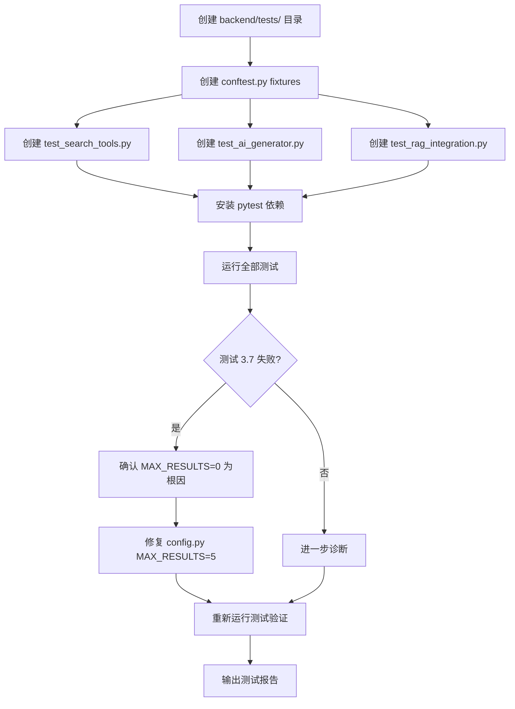

# RAG Chatbot Debugging Test Plan

## 1. Problem Analysis

用户报告 RAG chatbot 对任何内容相关的问题都返回 "query failed"。

### 1.1 关键代码追踪

请求链路：
```
POST /api/query → rag_system.query() → ai_generator.generate_response() 
→ LLM tool call → ToolManager.execute_tool("search_course_content", ...)
→ CourseSearchTool.execute(query, ...) → VectorStore.search(query, ...)
→ chroma_db.query(n_results=search_limit, ...)
```

### 1.2 已发现的严重 Bug

**Bug 1 (根因): `MAX_RESULTS = 0`** — [`backend/config.py:23`](../backend/config.py:23)

```python
MAX_RESULTS: int = 0        # Maximum search results to return
```

在 [`backend/vector_store.py:90-97`](../backend/vector_store.py:90-97) 中：
```python
search_limit = limit if limit is not None else self.max_results  # → 0
results = self.course_content.query(
    query_texts=[query],
    n_results=search_limit,  # ChromaDB 要求 n_results > 0!
    where=filter_dict
)
```

ChromaDB 的 `n_results` 参数必须为正整数。传入 `0` 会导致 ChromaDB 抛出异常，被 `except` 捕获后返回 `SearchResults.empty("Search error: ...")`，最终 CourseSearchTool 返回错误字符串，LLM 回复 "query failed"。

**Bug 2 (潜在): Chunk 前缀不一致** — [`backend/document_processor.py:186`](../backend/document_processor.py:186) vs [`backend/document_processor.py:234`](../backend/document_processor.py:234)

第一个 chunk 的前缀是 `"Lesson X content:"`，后续 chunk 的前缀是 `"Course Y Lesson X content:"`。这种不一致可能影响搜索质量。

---

## 2. 测试方案架构

### 2.1 测试文件结构

```
backend/
├── tests/
│   ├── __init__.py
│   ├── conftest.py              # pytest fixtures (mock objects, test data)
│   ├── test_search_tools.py     # Test 1: CourseSearchTool.execute()
│   ├── test_ai_generator.py     # Test 2: AIGenerator tool calling
│   └── test_rag_integration.py  # Test 3: End-to-end RAG flow
```

### 2.2 依赖项

需要在 `pyproject.toml` 中添加或确保可用：
- `pytest` — 测试框架
- `pytest-mock` — mock 支持（或直接使用 `unittest.mock`）

---

## 3. 详细测试用例

### Test Suite 1: `test_search_tools.py` — CourseSearchTool.execute()

| # | 测试用例 | 验证点 |
|---|---------|--------|
| 1.1 | `test_execute_valid_query` | mock VectorStore 返回正常结果；验证输出包含 `[course_title - Lesson X]` 格式 |
| 1.2 | `test_execute_with_course_filter` | 传入 course_name，验证 VectorStore.search 被正确调用 |
| 1.3 | `test_execute_with_lesson_filter` | 传入 lesson_number，验证 filter 传递正确 |
| 1.4 | `test_execute_all_filters` | 同时传入 course_name + lesson_number |
| 1.5 | `test_execute_no_results` | mock 空结果；验证返回 "No relevant content found" |
| 1.6 | `test_execute_course_not_found` | mock error；验证返回错误信息 |
| 1.7 | `test_execute_chromadb_error` | mock search 抛出异常；验证优雅降级 |
| 1.8 | `test_format_results_sources` | 验证 `last_sources` 被正确填充 |
| 1.9 | `test_execute_empty_query` | 空字符串查询的行为 |

### Test Suite 2: `test_ai_generator.py` — AIGenerator 工具调用

| # | 测试用例 | 验证点 |
|---|---------|--------|
| 2.1 | `test_system_prompt_has_search_tool_ref` | SYSTEM_PROMPT 包含 "search_course_content" |
| 2.2 | `test_tool_definitions_passed_to_api` | mock OpenAI client；验证 tools 参数被传递 |
| 2.3 | `test_tool_choice_is_auto` | 验证 tool_choice = "auto" |
| 2.4 | `test_generate_response_no_tools` | 不传 tools 时正常返回 |
| 2.5 | `test_handle_tool_execution` | mock tool_calls 响应；验证 ToolManager.execute_tool 被调用 |
| 2.6 | `test_tool_manager_routes_correctly` | ToolManager 将 search_course_content 路由到 CourseSearchTool |
| 2.7 | `test_tool_manager_unknown_tool` | 未知 tool 名称返回错误 |
| 2.8 | `test_get_last_sources` | 验证 ToolManager.get_last_sources() 正确返回来源 |

### Test Suite 3: `test_rag_integration.py` — 端到端 RAG 流程

| # | 测试用例 | 验证点 |
|---|---------|--------|
| 3.1 | `test_rag_system_initialization` | RAGSystem 初始化所有组件 |
| 3.2 | `test_query_with_mocked_tool_call` | mock 整个 AI 调用链；验证 query() 返回 (str, list) |
| 3.3 | `test_query_empty_vector_store` | 无数据时 query 的行为 |
| 3.4 | `test_outline_detection` | 含 outline 关键词的 query 触发 outline pre-fetch |
| 3.5 | `test_session_management` | session_id 传递正确 |
| 3.6 | `test_sources_reset_after_query` | 验证 sources 在每次 query 后被重置 |
| 3.7 | `test_config_max_results_zero` | **关键测试**：模拟 MAX_RESULTS=0 时 VectorStore.search 的行为 |

---

## 4. 预期测试结果

| 测试 | 预期结果 | 说明 |
|------|---------|------|
| 1.1–1.9 (search_tools) | ✅ 全部通过 | CourseSearchTool 本身逻辑正确 |
| 2.1–2.8 (ai_generator) | ✅ 全部通过 | AIGenerator 代理逻辑正确 |
| 3.1–3.6 (integration) | ✅ 通过 | 正常流程正确 |
| **3.7 (MAX_RESULTS=0)** | **❌ 失败** | **确认 Bug：n_results=0 导致 ChromaDB 异常** |

---

## 5. 修复方案

### 修复 1 (关键): 修正 `MAX_RESULTS` 默认值 — [`backend/config.py:23`](../backend/config.py:23)

```python
# 修改前
MAX_RESULTS: int = 0

# 修改后
MAX_RESULTS: int = 5
```

**影响范围**：仅 [`backend/config.py`](../backend/config.py) 第 23 行。

### 修复 2 (建议): Chunk 前缀一致性 — [`backend/document_processor.py:186`](../backend/document_processor.py:186)

将第一个 chunk 的前缀从 `"Lesson X content:"` 改为 `"Course Y Lesson X content:"` 以保持一致：

```python
# 修改前 (line 186)
chunk_with_context = f"Lesson {current_lesson} content: {chunk}"

# 修改后
chunk_with_context = f"Course {course_title} Lesson {current_lesson} content: {chunk}"
```

---

## 6. 执行计划


